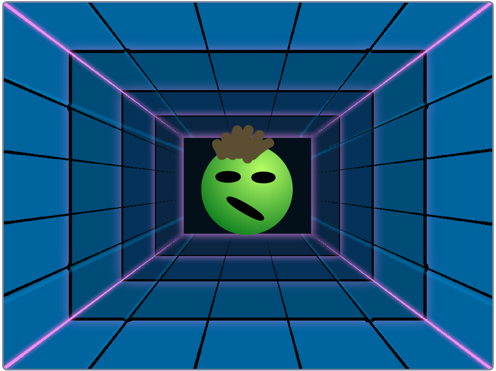

## Introduction

Use Scratch to create a stress ball that you can squash!

### What you will make

--- no-print ---
Click or tap on the stress ball to squash it and hear the sound that it makes.

  <iframe src="https://scratch.mit.edu/projects/401316899/embed" allowtransparency="true" width="485" height="402" frameborder="0" scrolling="no" allowfullscreen></iframe>

--- /no-print ---

--- print-only ---

--- /print-only ---

--- collapse ---
---
title: What you will need
---
#### Hardware

+ A computer or tablet capable of running Scratch

#### Software

+ Scratch 3 (either [online](https://scratch.mit.edu/){:target="_blank"} or [offline](https://scratch.mit.edu/download){:target="_blank"})

--- /collapse ---

--- collapse ---
---
title: What you will learn
---

+ How to add code to sprites and a backdrop
+ How to use the tools in the Paint editor to add details to a sprite
+ How to add `graphic effects`{:class="block3looks"} and `sound`{:class="block3sound"} to a sprite

--- /collapse ---

--- collapse ---
---
title: Additional information for educators
---

You can [download the completed project here](http://rpf.io/p/en/stress-ball-get){:target="_blank"}.

If you need to print this project, please use the [printer-friendly version](https://projects.raspberrypi.org/en/projects/stress-ball/print){:target="_blank"}.

--- /collapse ---

