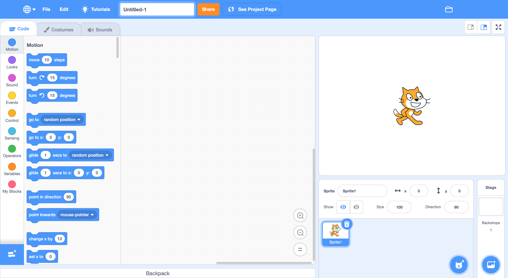
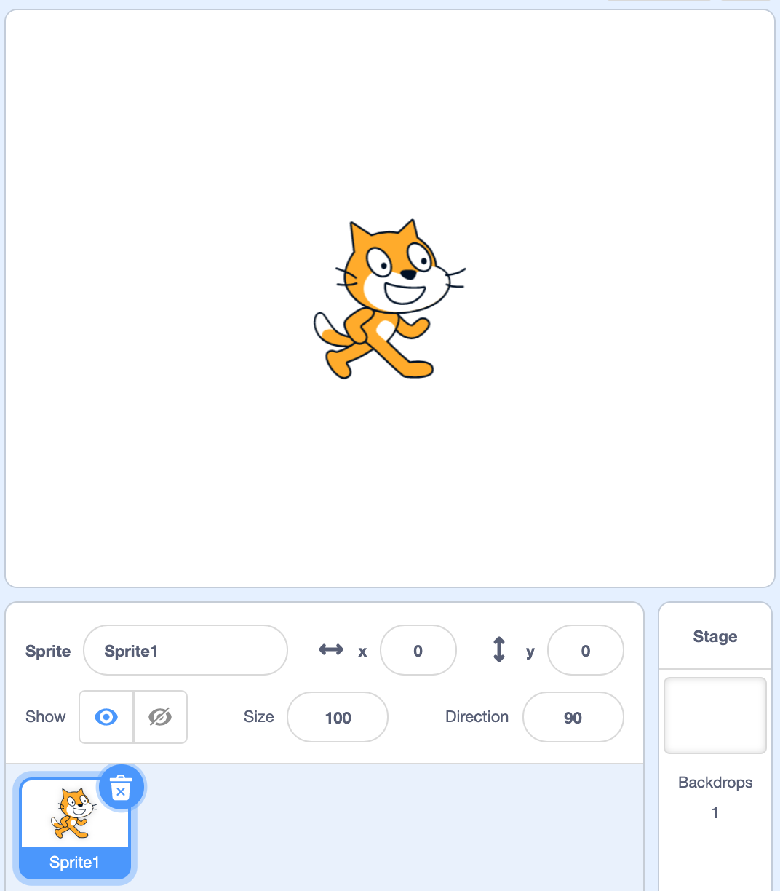
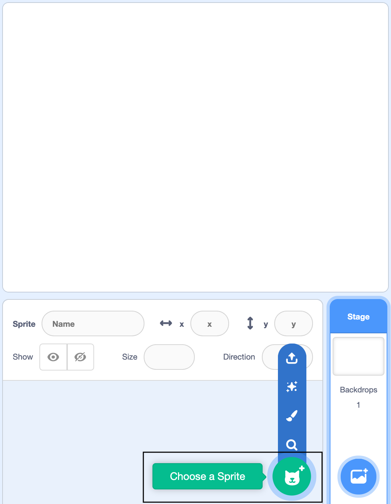
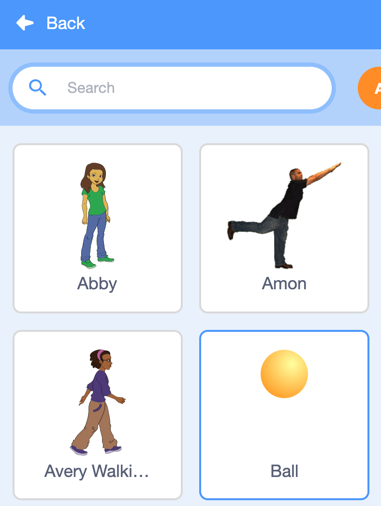
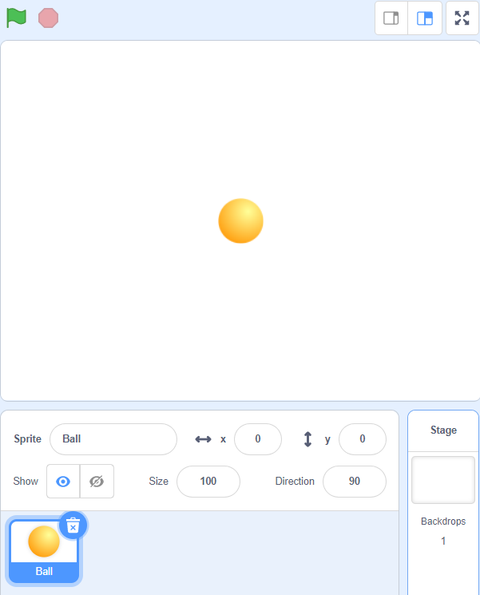
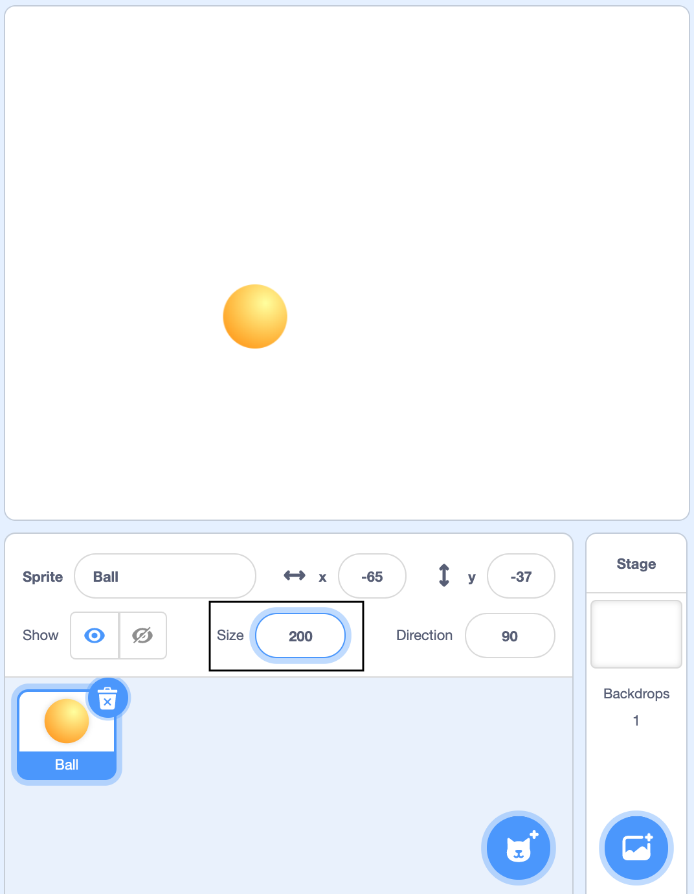
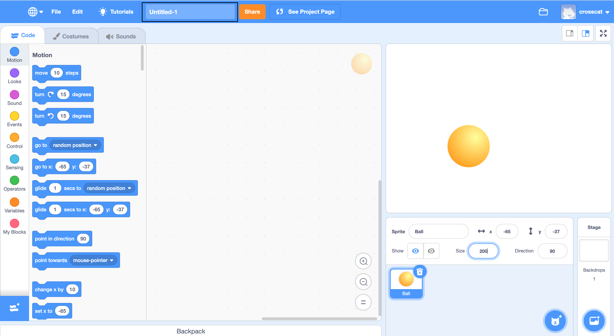
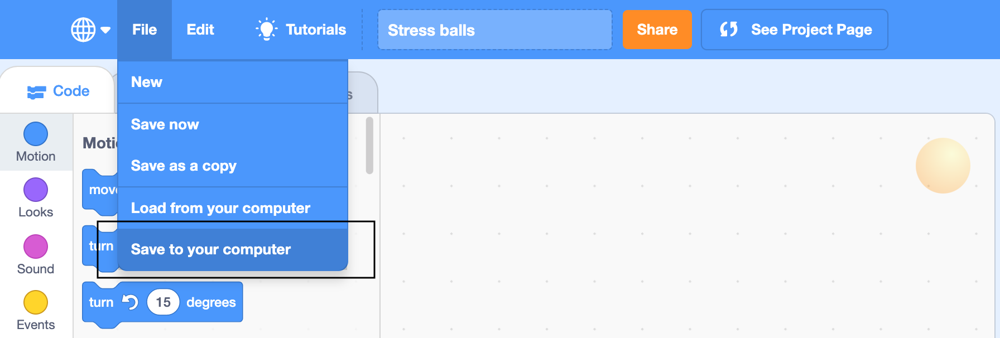

## Add a Ball sprite

__Sprites__ are the characters and objects in your project. You will create a **Ball** sprite and turn it into a stress ball.

--- task ---

Open a new Scratch project.

**Online:** open a new online Scratch project at [scratch.mit.edu](https://scratch.mit.edu/projects/editor){:target="_blank"}.

**Offline:** open a new project in the Scratch offline editor. If you need to, you can [download and install Scratch here](https://scratch.mit.edu/download){:target="_blank"}.

The Scratch environment that you will open looks like this:

--- /task ---

--- task ---

The cat sprite that you can see is the Scratch mascot.

--- no-print ---
Watch this short video, which shows what to do next.

--- /no-print ---

--- /task ---

Now, follow the instructions for each task below.

--- task ---

You don't need a cat for this project, so you can delete it: right-click on the cat sprite in the Sprite list and then click on **delete**.

{:width="400px"}

--- /task ---

--- task ---

Next, click on **Choose a Sprite** to open the Sprite Library.

If you are using a tablet, tap twice on the **Choose a Sprite** button.

{:width="400px"}

--- /task ---

--- task ---

Click on the **Ball** sprite to add it to your project.

{:width="300px"}

--- /task ---

The **Ball** sprite will appear on the Stage. The Stage is where all the action happens in your project.

--- task ---
Drag the **Ball** sprite to the middle of the Stage.

{:width="400px"}

--- /task ---

The ball is a bit small.

--- task ---
Below the Stage, there are some sprite settings that you can change. The size starts at `100` (percent). To make the sprite bigger, change it to `200` — this is double the size.  

{:width="400px"}

--- /task ---

--- task ---

Type the name of your program into the text box at the top of the screen, to give your program a name.

Next, click on **File**, and then on **Save now** to save your project.

If you are not online or you do not have a Scratch account, you can click on **Save to your computer** to save a copy of your project.

--- /task ---

--- save ---
