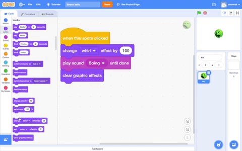
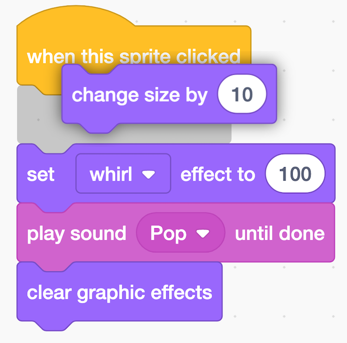

## Shrink it

Now, you will make the **Ball** sprite shrink as well as squash when you click on it.

--- task ---

--- no-print ---
Watch this short video, which shows what to do next.

 

--- /no-print ---
--- /task ---

Now, follow the instructions for each task below.

--- task ---
Drag a `change size by`{:class="block3looks"} block under your `when this sprite clicked`{:class="block3events"} block. A space will open up for the block and it will fit into place. 

{:width="300px"}

Your code should look like this:

```blocks3
when this sprite clicked
+change size by (10)
set [whirl v] effect to (100)
play sound [Boing v] until done
clear graphic effects
```
--- /task ---

--- task ---
The **Ball** sprite needs to get smaller when you click on it, so change the number in the `change size by`{:class="block3looks"} block from `10` to `-50`. Choosing a negative number will make the **Ball** sprite shrink:

```blocks3
when this sprite clicked
+change size by (-50)
set [whirl v] effect to (100)
play sound [Boing v] until done
clear graphic effects
```
--- /task ---

--- task ---
Now, add a `set size to`{:class="block3looks"} block to the bottom of your code and set the size of the **Ball** sprite back to `200` (percent): 

```blocks3
when this sprite clicked
change size by (-50)
set [whirl v] effect to (100)
play sound [Boing v] until done
clear graphic effects
+set size to (200)%
```

--- /task ---

--- task ---
Click on your stress ball to see if it is working correctly. 

--- /task ---

__Tip:__ You can delete a block by dragging it towards the Blocks menu on the left-hand side.

--- save ---
