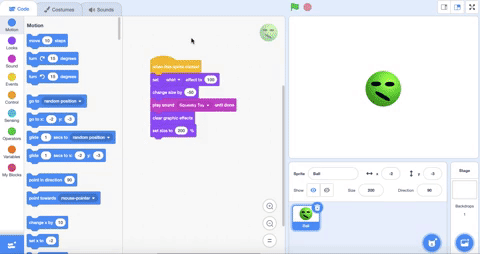
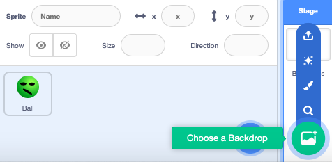
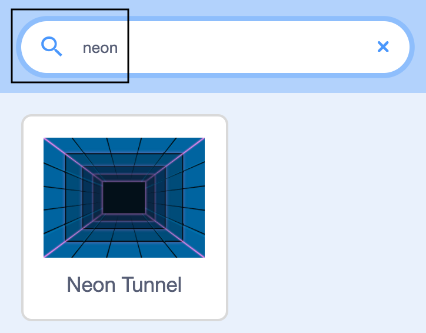
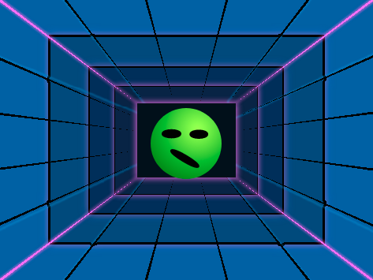

## Insert a backdrop

Now, you will add a colourful backdrop to your project. At the moment, the Stage is white and boring!

--- no-print ---

--- task ---
Watch this short video, which shows what to do next.

 

--- /task ---

--- /no-print ---

Now, follow the instructions for each task below.

--- task ---

Click on **Choose a Backdrop** to add a backdrop to the **Stage**.

{:width="500px"}

--- /task ---

--- task ---

Type in `neon` or scroll down until you see the **Neon Tunnel** backdrop, then click on it. The backdrops are in alphabetical order. 

{:width="500px"}

--- /task ---

--- task ---

Your Stage should now look similar to this:

{:width="500px"}

--- /task ---
